# x402 Payment Flow - Complete Guide

## Overview

This document explains the complete payment flow for x402 with ElizaOS AI agents, API servers, and blockchain settlement.

## High-Level Flow

```
┌──────────────┐
│   AI Agent   │ (ElizaOS)
│   (Buyer)    │
└──────┬───────┘
       │ 1. Request resource
       ▼
┌──────────────┐
│  API Server  │
│  (Seller)    │
└──────┬───────┘
       │ 2. Return 402 + payment requirements
       ▼
┌──────────────┐
│   AI Agent   │
└──────┬───────┘
       │ 3. Evaluate price & budget
       ▼
┌──────────────┐
│   AI Agent   │
└──────┬───────┘
       │ 4. Sign USDC transaction
       ▼
┌──────────────┐
│  API Server  │
└──────┬───────┘
       │ 5. Verify signature
       ▼
┌──────────────┐
│ Facilitator  │
└──────┬───────┘
       │ 6. Settle on blockchain
       ▼
┌──────────────┐
│  Blockchain  │ (BNB/Base)
└──────┬───────┘
       │ 7. Confirm transaction
       ▼
┌──────────────┐
│  API Server  │
└──────┬───────┘
       │ 8. Deliver resource
       ▼
┌──────────────┐
│   AI Agent   │
└──────────────┘
```

## Detailed Flow

### Phase 1: Initial Request (No Payment)

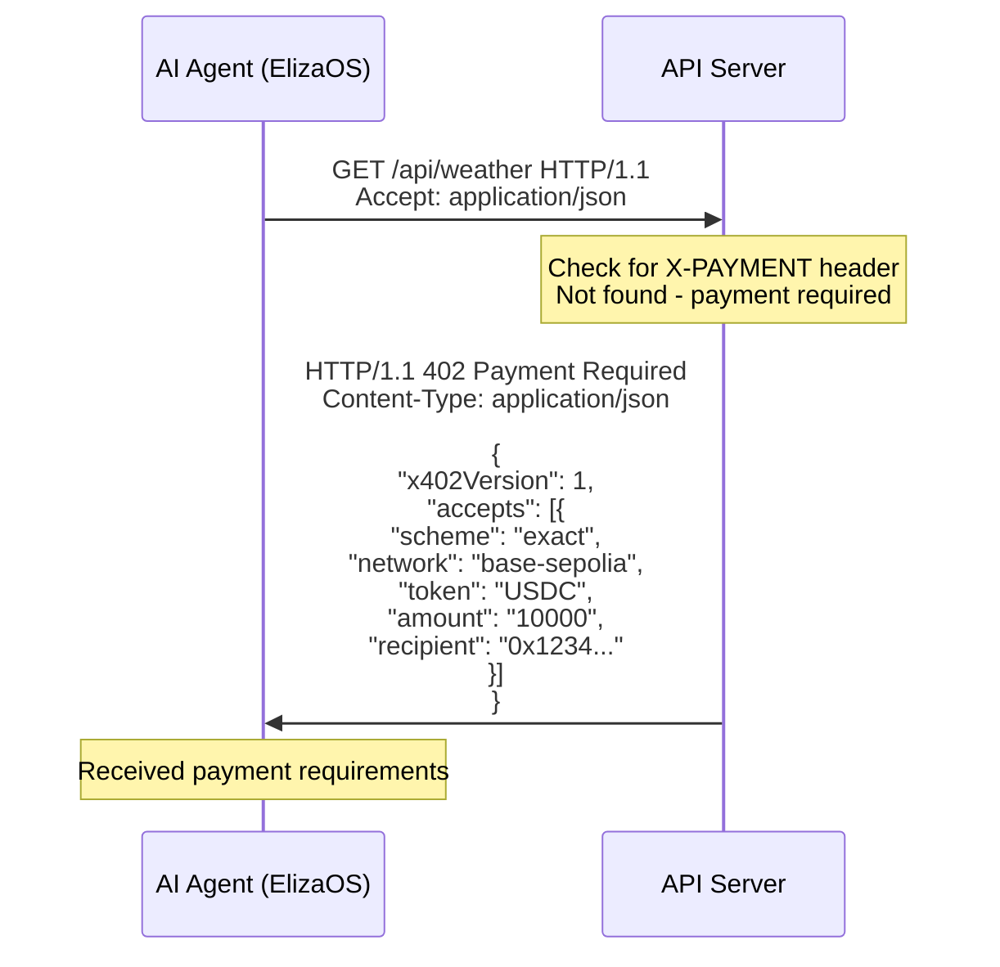

**HTTP Request:**
```http
GET /api/weather HTTP/1.1
Host: api.example.com
Accept: application/json
```

**HTTP Response (402):**
```http
HTTP/1.1 402 Payment Required
Content-Type: application/json

{
  "x402Version": 1,
  "accepts": [
    {
      "scheme": "exact",
      "network": "base-sepolia",
      "token": "USDC",
      "amount": "10000",
      "recipient": "0x1234567890abcdef1234567890abcdef12345678"
    }
  ]
}
```

### Phase 2: Agent Evaluation

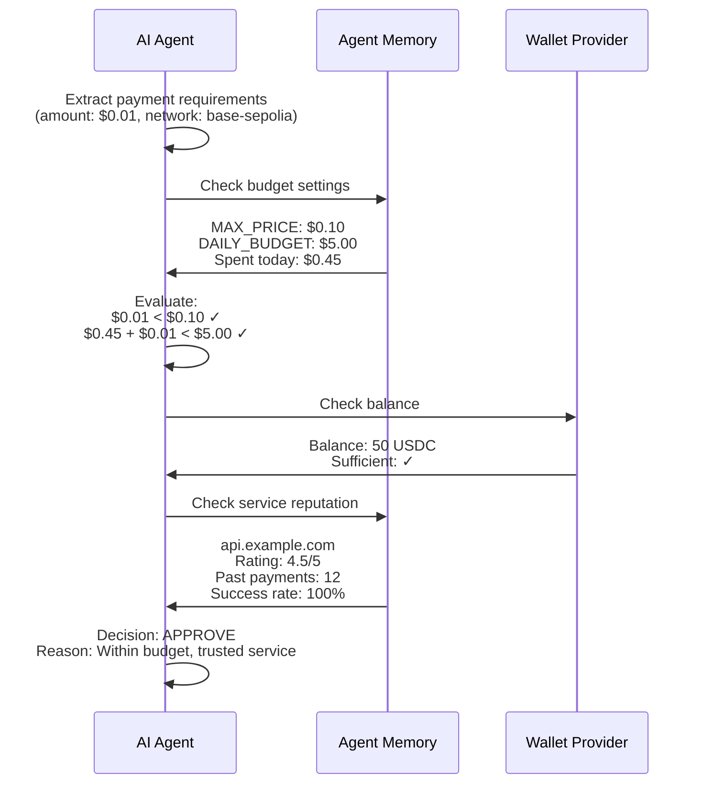

**Agent Decision Logic:**
```typescript
async function evaluatePayment(requirements) {
  const price = parseFloat(requirements.amount) / 1e6; // Convert to dollars
  
  // Check 1: Price within per-request limit
  if (price > agent.MAX_PRICE_PER_REQUEST) {
    return { decision: 'REJECT', reason: 'Exceeds max price' };
  }
  
  // Check 2: Daily budget not exceeded
  const spentToday = await agent.getSpentToday();
  if (spentToday + price > agent.DAILY_BUDGET) {
    return { decision: 'REJECT', reason: 'Daily budget exceeded' };
  }
  
  // Check 3: Wallet has sufficient balance
  const balance = await agent.getWalletBalance();
  if (balance < price) {
    return { decision: 'REJECT', reason: 'Insufficient balance' };
  }
  
  // Check 4: Service reputation
  const reputation = await agent.getServiceReputation(requirements.url);
  if (reputation.rating < 3.0) {
    return { decision: 'REJECT', reason: 'Low service reputation' };
  }
  
  // Auto-approve small amounts
  if (price < agent.AUTO_APPROVE_UNDER) {
    return { decision: 'APPROVE', reason: 'Auto-approved (small amount)' };
  }
  
  return { decision: 'APPROVE', reason: 'Within budget and trusted' };
}
```

### Phase 3: Transaction Signing (Offline)

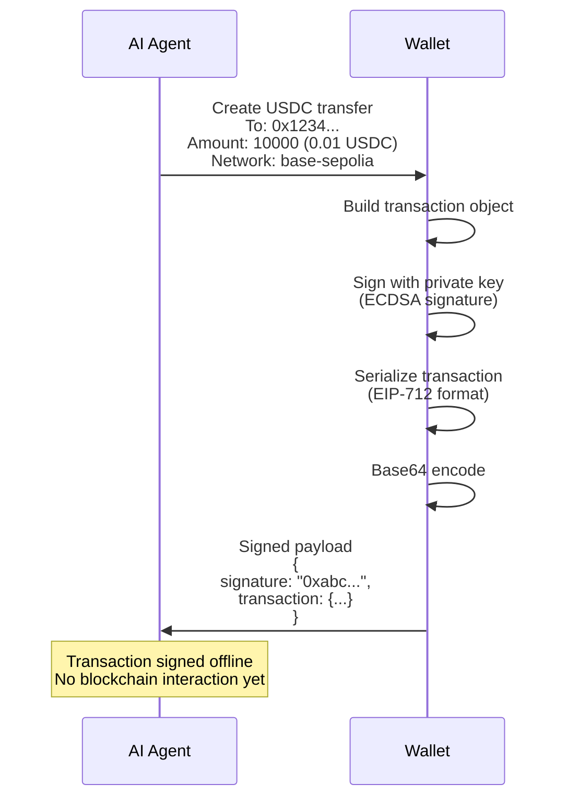

**Transaction Structure (Base):**
```json
{
  "x402Version": 1,
  "scheme": "exact",
  "network": "base-sepolia",
  "payload": {
    "from": "0x742d35Cc6634C0532925a3b844Bc9e7595f0bEb",
    "to": "0x1234567890abcdef1234567890abcdef12345678",
    "value": "10000",
    "token": "0xUSDC_CONTRACT_ADDRESS",
    "validAfter": 1698156000,
    "validBefore": 1698159600,
    "nonce": "0x123abc...",
    "signature": "0x456def..."
  }
}
```

### Phase 4: Payment Request

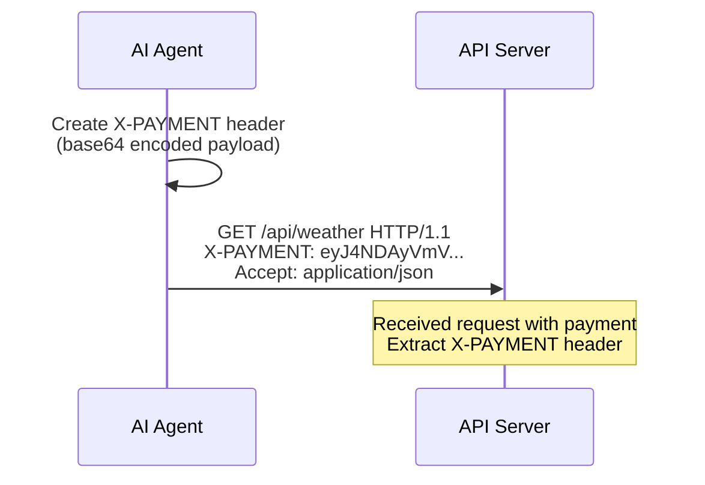

**HTTP Request with Payment:**
```http
GET /api/weather HTTP/1.1
Host: api.example.com
Accept: application/json
X-PAYMENT: eyJ4NDAyVmVyc2lvbiI6MSwic2NoZW1lIjoiZXhhY3QiLCJuZXR3b3JrIjoi...
```

### Phase 5: Payment Verification (Fast)

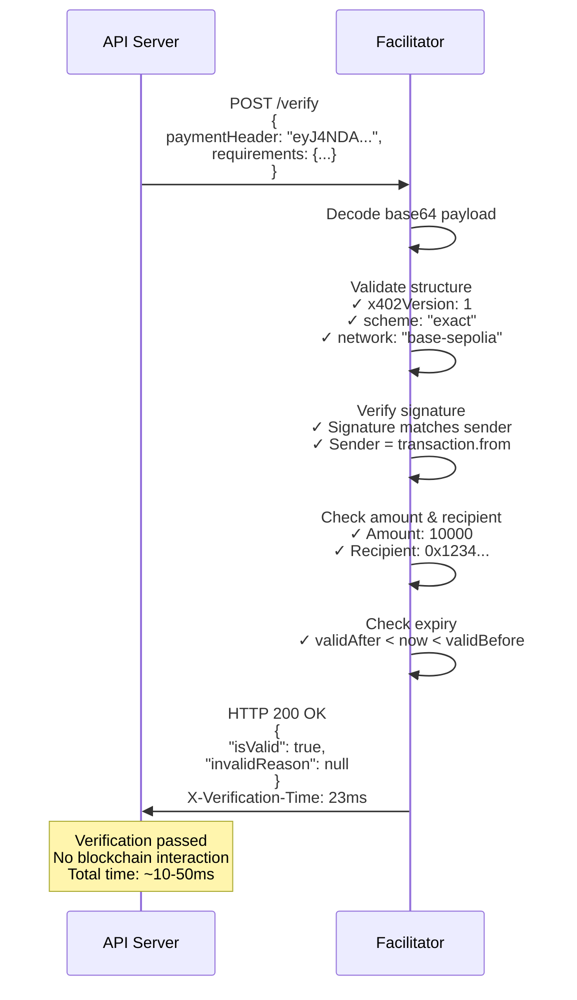

**Verification Checks:**
1. ✅ Valid base64 encoding
2. ✅ Correct x402Version (1)
3. ✅ Supported scheme ("exact")
4. ✅ Valid network identifier
5. ✅ Cryptographic signature is valid
6. ✅ Amount matches requirement
7. ✅ Recipient matches requirement
8. ✅ Transaction not expired
9. ✅ Nonce not previously used (replay protection)

### Phase 6: Payment Settlement (Slow)

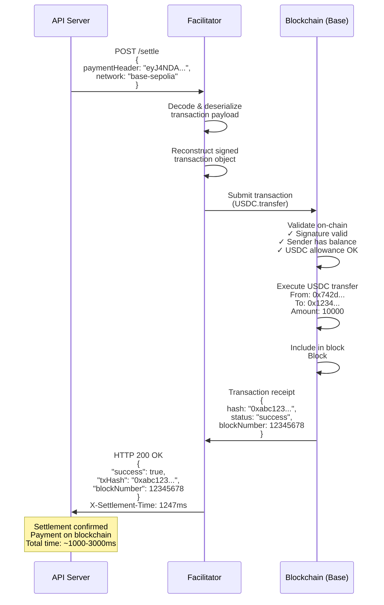

**Settlement on Base:**
```typescript
// Facilitator submits transaction
const provider = new ethers.JsonRpcProvider(RPC_URL);
const tx = await provider.sendTransaction(signedTx);
const receipt = await tx.wait(1); // Wait for 1 confirmation

// Result
{
  hash: "0xabc123...",
  blockNumber: 12345678,
  gasUsed: "21000",
  status: 1 // success
}
```

### Phase 7: Resource Delivery

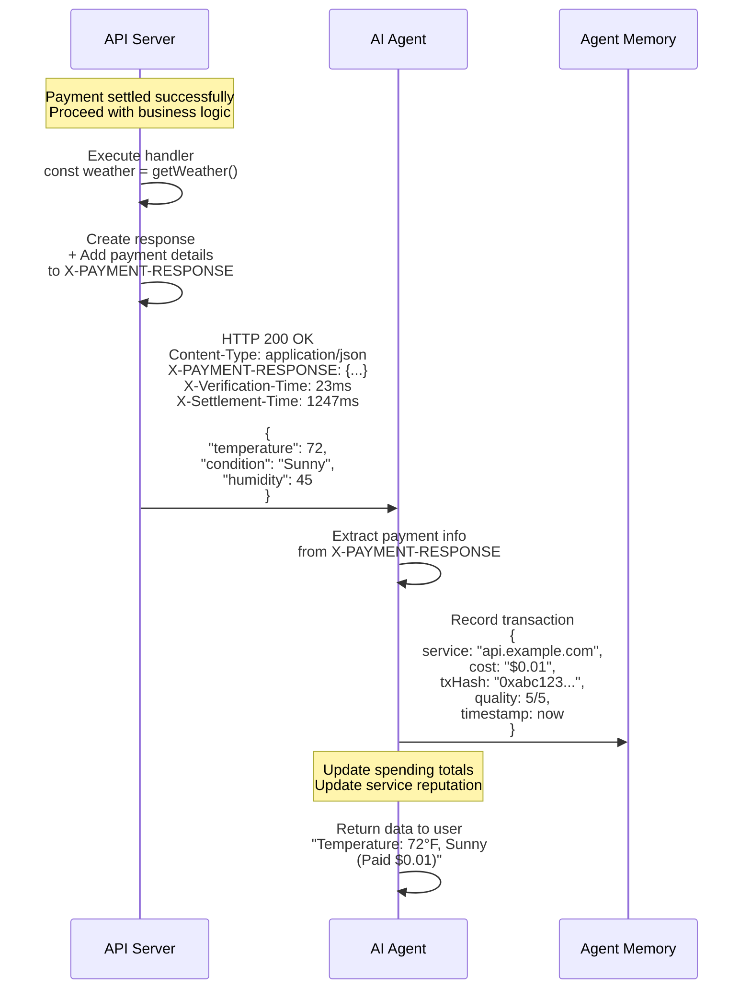

**HTTP Response (Success):**
```http
HTTP/1.1 200 OK
Content-Type: application/json
X-Payment-Response: {"settlement":{"txHash":"0xabc123...","amount":"10000"}}
X-Verification-Time: 23ms
X-Settlement-Time: 1247ms

{
  "temperature": 72,
  "condition": "Sunny",
  "humidity": 45,
  "location": "San Francisco",
  "paid": true
}
```

## Error Flows

### Error: Insufficient Balance

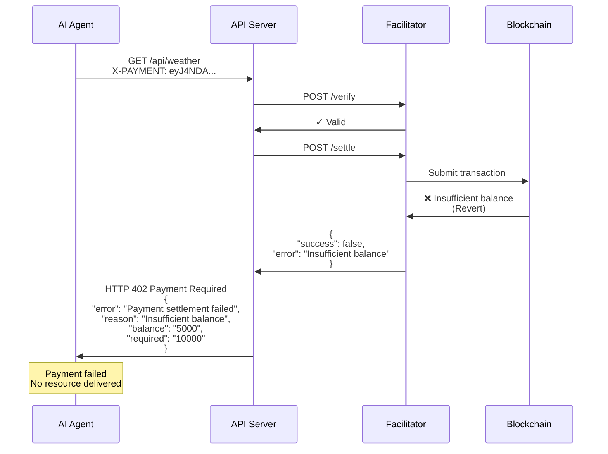

### Error: Invalid Signature

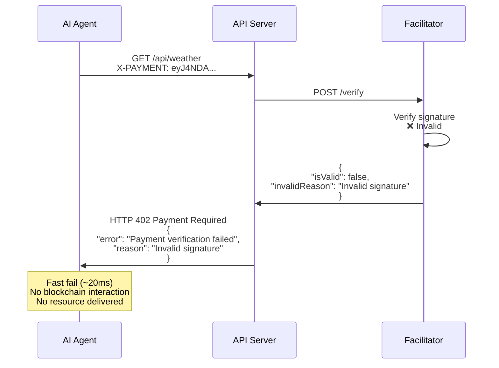

### Error: Price Too High (Agent Rejects)

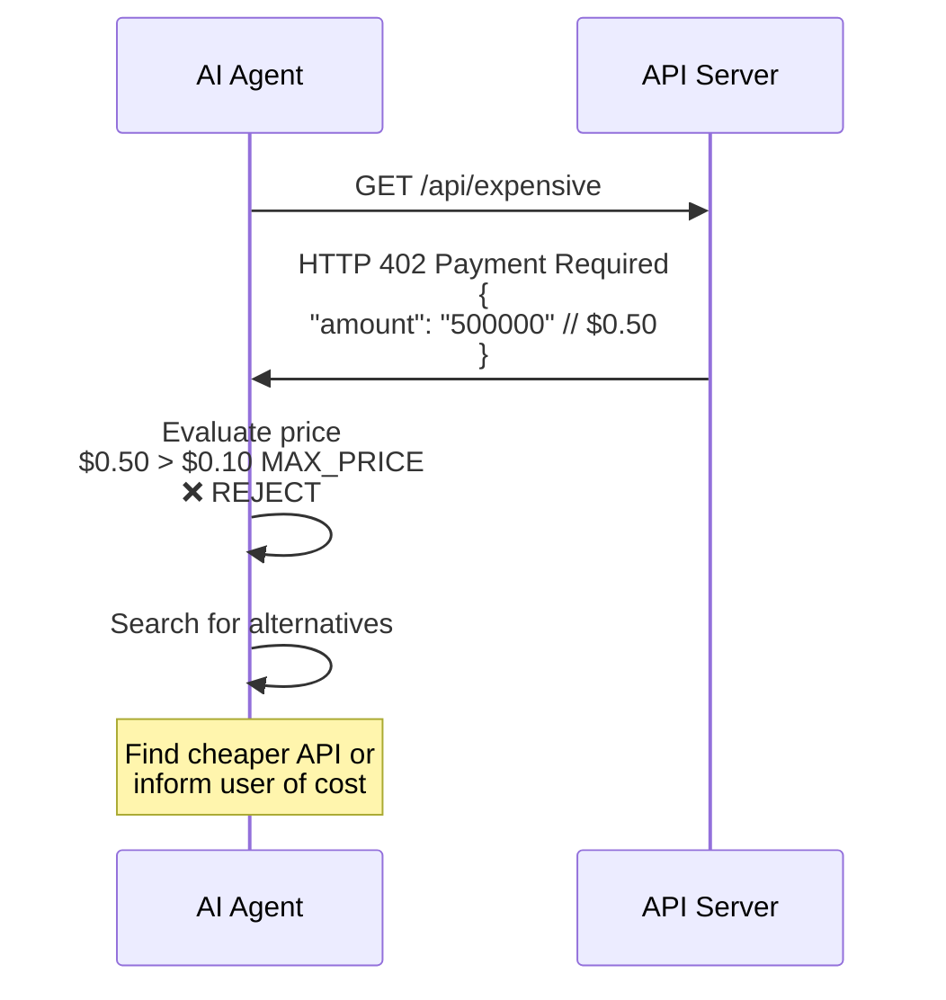

## Timing Breakdown

| Phase | Duration | Blockchain | Description |
|-------|----------|------------|-------------|
| Initial 402 | 10-50ms | ❌ No | Server returns requirements |
| Agent Evaluation | 50-200ms | ❌ No | Agent decides to pay |
| Sign Transaction | 50-200ms | ❌ No | Create & sign offline |
| Verification | 10-50ms | ❌ No | Cryptographic validation |
| Settlement | 400ms-3s | ✅ Yes | Blockchain confirmation |
| API Processing | 10-100ms | ❌ No | Business logic |
| **Total (first call)** | **1-3.5s** | - | End-to-end with payment |
| **Total (cached)** | **10-150ms** | ❌ No | If response cached |

## Caching Strategy

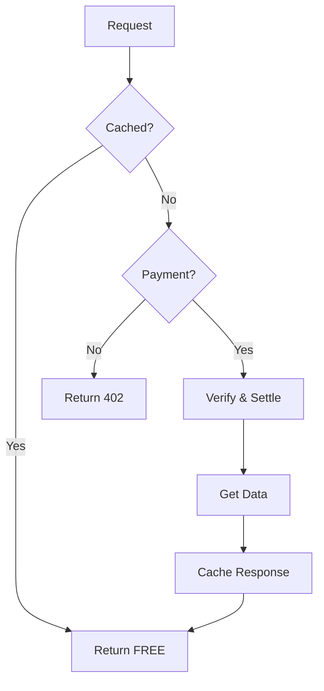

**Implementation:**
```typescript
async function handleRequest(req, res) {
  // Check cache first
  const cached = await redis.get(cacheKey);
  if (cached) {
    return res.json(JSON.parse(cached)); // FREE!
  }
  
  // Cache miss - require payment
  const payment = req.headers['x-payment'];
  if (!payment) {
    return res.status(402).json(paymentRequirements);
  }
  
  // Verify & settle payment
  await verifyAndSettle(payment);
  
  // Get data
  const data = await getData();
  
  // Cache for 5 minutes
  await redis.setex(cacheKey, 300, JSON.stringify(data));
  
  return res.json(data);
}
```

## Complete Flow Summary

```
1. Agent requests resource → 2. Server returns 402
   ↓                              ↓
3. Agent evaluates price    ←  ─  ┘
   ↓
4. Agent signs transaction (offline)
   ↓
5. Agent retries with X-PAYMENT
   ↓
6. Server verifies signature (~20ms, no blockchain)
   ↓
7. Server settles payment (~1-3s, blockchain)
   ↓
8. Server delivers resource
   ↓
9. Agent records transaction & updates reputation

Total: ~1-3 seconds (with blockchain)
       ~20-100ms (if cached)
```

## Key Principles

1. **Fast Verification**: Cryptographic checks without blockchain (10-50ms)
2. **Atomic Delivery**: Resource ONLY delivered after blockchain confirmation
3. **Agent Autonomy**: AI decides based on budget and reputation
4. **Replay Protection**: Each transaction can only be used once
5. **Caching**: Avoid paying for repeated identical requests

## Resources

- [Protocol Sequence Diagram](protocol-sequence.md)
- [HTTP 402 Concepts](core-concepts/http-402.md)
- [ElizaOS Integration](core-concepts/elizaos.md)
- [API Reference](api-reference/server-api.md)

---

**x402 Flow: From request to payment to delivery in ~1-3 seconds**