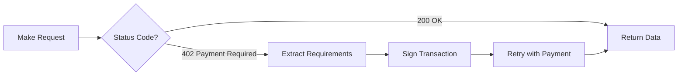

# Quick Start: x402 Client Wrappers

The easiest way to consume x402-protected APIs is using pre-built client wrappers. These handle the full 402 → pay → retry flow automatically.

## Installation

### For ElizaOS Agents (Recommended)

```bash
# ElizaOS comes with x402 support built-in
https://github.com/LolyxMoon/Sofiax402
cd eliza
pnpm install
```

### For JavaScript/TypeScript Projects

```bash
npm install x402-axios
# or
npm install x402-fetch
```

## ElizaOS Agent (Recommended for AI Agents)

### Basic Setup

```typescript
// character.json
{
  "name": "Sofia",
  "bio": ["AI agent that can pay for services autonomously"],
  "plugins": [
    "@elizaos/plugin-x402",
    "@elizaos/plugin-solana"
  ],
  "settings": {
    "secrets": {
      "WALLET_PRIVATE_KEY": "your_private_key",
      "SOLANA_RPC_URL": "https://api.devnet.solana.com"
    },
    "MAX_PRICE_PER_REQUEST": "0.10",
    "DAILY_BUDGET": "5.00"
  }
}
```

### Using x402 Actions

```typescript
// Agent automatically pays for services
import { payForServiceAction } from '@elizaos/plugin-x402';

const agent = {
  actions: [payForServiceAction],
  // ... other config
};

// User: "Get me weather data from the premium API"
// Agent: *automatically detects 402*
// Agent: *evaluates price ($0.01)*
// Agent: *pays with USDC*
// Agent: "Here's the weather: 72°F, Sunny (Paid $0.01)"
```

## x402-axios (For Node.js Applications)

### Basic Usage

```typescript
import { withPaymentInterceptor } from 'x402-axios';
import { privateKeyToAccount } from 'viem/accounts';
import axios from 'axios';

// Create account from private key
const account = privateKeyToAccount('0xYourPrivateKey');

// Add payment interceptor to axios instance
const client = withPaymentInterceptor(
  axios.create({ baseURL: 'https://api.example.com' }),
  account
);

// Make requests normally - payment handled automatically!
const response = await client.get('/premium/weather');
console.log(response.data);

// Check payment info
const paymentResponse = decodeXPaymentResponse(
  response.headers['x-payment-response']
);
console.log('Paid:', paymentResponse.settlement.amount);
console.log('TX Hash:', paymentResponse.settlement.txHash);
```

### POST Requests

```typescript
const analysis = await client.post('/api/analyze', {
  text: 'Hello world',
  language: 'en'
});

console.log(analysis.data);
```

### Custom Headers

```typescript
const result = await client.get('/api/data', {
  headers: {
    'X-Custom-Header': 'value',
    'Accept': 'application/json'
  }
});
```

## x402-fetch (For Modern JavaScript)

### Basic Usage

```typescript
import { withPaymentHeaders } from 'x402-fetch';
import { privateKeyToAccount } from 'viem/accounts';

const account = privateKeyToAccount('0xYourPrivateKey');

// Wrap fetch with automatic payment
const response = await withPaymentHeaders(
  fetch('https://api.example.com/premium/data'),
  account
);

const data = await response.json();
console.log(data);
```

### POST with Body

```typescript
const response = await withPaymentHeaders(
  fetch('https://api.example.com/analyze', {
    method: 'POST',
    headers: { 'Content-Type': 'application/json' },
    body: JSON.stringify({ text: 'Hello world' })
  }),
  account
);
```

## Python (httpx)

### Basic Usage

```python
from x402_httpx import with_payment_headers
from eth_account import Account

# Create account
private_key = "0xYourPrivateKey"
account = Account.from_key(private_key)

# Make request with automatic payment
import httpx
response = with_payment_headers(
    httpx.get("https://api.example.com/premium/data"),
    account
)

print(response.json())
```

## What These Wrappers Do

All x402 client wrappers follow the same pattern:

1. **Make initial request** to API endpoint
2. **Detect 402 response** with payment requirements
3. **Extract payment details** (amount, recipient, network)
4. **Sign transaction** with your private key (offline)
5. **Retry request** with X-PAYMENT header
6. **Return response** with data + payment info



## Network Configuration

### Solana (Fast, Low Cost)

```typescript
// ElizaOS
{
  "settings": {
    "NETWORK": "solana-devnet", // or solana-mainnet
    "SOLANA_RPC_URL": "https://api.devnet.solana.com"
  }
}

// Viem (not supported for Solana, use Solana SDK)
```

### Base (Ethereum L2)

```typescript
// ElizaOS
{
  "settings": {
    "NETWORK": "base-sepolia", // or base
    "BASE_RPC_URL": "https://sepolia.base.org"
  }
}

// Viem
import { privateKeyToAccount } from 'viem/accounts';
import { baseSepolia } from 'viem/chains';
import { createWalletClient, http } from 'viem';

const account = privateKeyToAccount('0x...');
const client = createWalletClient({
  account,
  chain: baseSepolia,
  transport: http()
});
```

## Error Handling

### Payment Failed

```typescript
try {
  const response = await client.get('/premium/data');
  console.log(response.data);
} catch (error) {
  if (error.response?.status === 402) {
    console.error('Payment failed:', error.response.data.message);
    // Possible reasons:
    // - Insufficient balance
    // - Invalid signature
    // - Network issues
  }
}
```

### Network Errors

```typescript
try {
  const response = await client.get('/premium/data', {
    timeout: 5000 // 5 second timeout
  });
} catch (error) {
  if (error.code === 'ECONNABORTED') {
    console.error('Request timed out');
  } else if (error.code === 'ENOTFOUND') {
    console.error('API endpoint not found');
  }
}
```

## Advanced Usage

### Custom Payment Evaluation (ElizaOS)

```typescript
// Evaluate before paying
import { evaluatePricingAction } from '@elizaos/plugin-x402';

const evaluation = await agent.executeAction('EVALUATE_PRICING', {
  url: 'https://api.example.com/expensive/data'
});

if (evaluation.affordable) {
  // Proceed with payment
  await agent.executeAction('PAY_FOR_SERVICE', {
    url: 'https://api.example.com/expensive/data'
  });
} else {
  // Find cheaper alternative
  const alternatives = evaluation.alternatives;
  console.log('Cheaper options:', alternatives);
}
```

### Retry Logic

```typescript
import axios from 'axios';
import axiosRetry from 'axios-retry';

const client = withPaymentInterceptor(
  axios.create({ baseURL: 'https://api.example.com' }),
  account
);

// Add retry logic for network failures (not payment failures)
axiosRetry(client, {
  retries: 3,
  retryDelay: axiosRetry.exponentialDelay,
  retryCondition: (error) => {
    // Retry on network errors, not payment errors
    return axiosRetry.isNetworkError(error) && 
           error.response?.status !== 402;
  }
});
```

### Response Caching

```typescript
import { setupCache } from 'axios-cache-interceptor';

const client = setupCache(
  withPaymentInterceptor(
    axios.create({ baseURL: 'https://api.example.com' }),
    account
  )
);

// First request: Pays $0.01
const response1 = await client.get('/weather');

// Second request within cache window: Free!
const response2 = await client.get('/weather');
// Served from cache, no payment required
```

## Testing with Testnet

### Get Test Tokens

**Solana Devnet:**
```bash
# Get test SOL
solana airdrop 1 YOUR_ADDRESS --url devnet

# Get test USDC from Circle faucet
# https://faucet.circle.com/
```

**Base Sepolia:**
```bash
# Get test ETH from Coinbase faucet
# https://portal.cdp.coinbase.com/products/faucet

# Get test USDC from Circle faucet
# https://faucet.circle.com/
```

### Test Configuration

```typescript
// ElizaOS test character
{
  "name": "TestAgent",
  "settings": {
    "NETWORK": "base-sepolia", // Always use testnet first!
    "MAX_PRICE_PER_REQUEST": "0.10",
    "WALLET_PRIVATE_KEY": "0xYourTestPrivateKey"
  }
}
```

## Comparison of Wrappers

| Feature | ElizaOS | x402-axios | x402-fetch | x402-httpx |
|---------|---------|------------|------------|------------|
| **Language** | TypeScript | TypeScript | TypeScript | Python |
| **Platform** | AI Agents | Node.js | Browser/Node | Python |
| **Autonomous** | ✅ Yes | ❌ No | ❌ No | ❌ No |
| **Budget Control** | ✅ Yes | ❌ No | ❌ No | ❌ No |
| **Price Evaluation** | ✅ Yes | ❌ No | ❌ No | ❌ No |
| **Service Discovery** | ✅ Yes | ❌ No | ❌ No | ❌ No |
| **Auto Retry** | ✅ Yes | ✅ Yes | ✅ Yes | ✅ Yes |
| **Caching** | ✅ Yes | ⚙️ Manual | ⚙️ Manual | ⚙️ Manual |
| **Best For** | AI agents | Node APIs | Web apps | Python |

## Real-World Example: Weather Agent

```typescript
// ElizaOS agent that autonomously pays for weather data

// 1. Define character
{
  "name": "WeatherBot",
  "bio": ["I provide weather data from premium APIs"],
  "plugins": ["@elizaos/plugin-x402"],
  "settings": {
    "MAX_PRICE_PER_REQUEST": "0.05", // Max $0.05 per call
    "DAILY_BUDGET": "2.00"            // Max $2 per day
  }
}

// 2. User asks: "What's the weather in San Francisco?"

// 3. Agent workflow:
// - Discovers weather API at https://api.weather.com/current
// - Makes request, receives 402 ($0.02 required)
// - Evaluates: $0.02 < $0.05 max ✓
// - Checks: $0.02 won't exceed daily budget ✓
// - Pays $0.02 USDC autonomously
// - Receives weather data
// - Responds: "San Francisco: 65°F, Foggy (Paid $0.02)"

// 4. User asks again 5 minutes later
// - Agent checks cache: weather data still fresh ✓
// - Responds from cache (FREE, no payment)
// - Total spent: Still $0.02

// All autonomous - no human approval needed!
```

## Best Practices

### 1. Always Use Testnet First

```typescript
// ❌ Don't do this
const agent = {
  settings: {
    NETWORK: "solana-mainnet" // Real money!
  }
};

// ✅ Do this
const agent = {
  settings: {
    NETWORK: "solana-devnet" // Test tokens
  }
};
```

### 2. Set Spending Limits

```typescript
// ✅ Protect against runaway costs
const agent = {
  settings: {
    MAX_PRICE_PER_REQUEST: "0.10",  // Per-request limit
    DAILY_BUDGET: "5.00",            // Daily limit
    WEEKLY_BUDGET: "20.00",          // Weekly limit
    AUTO_APPROVE_UNDER: "0.01"       // Auto-approve small amounts
  }
};
```

### 3. Implement Caching

```typescript
// ✅ Avoid paying for repeated requests
const cache = new Map();

async function getWeather(city) {
  const cached = cache.get(city);
  if (cached && Date.now() - cached.timestamp < 300000) {
    return cached.data; // Free! Cached for 5 minutes
  }
  
  // Cache miss - payment required
  const data = await client.get(`/weather/${city}`);
  cache.set(city, {
    data,
    timestamp: Date.now()
  });
  
  return data;
}
```

### 4. Monitor Spending

```typescript
// ✅ Track agent spending
const agent = {
  async logTransaction(tx) {
    await db.transactions.insert({
      timestamp: Date.now(),
      amount: tx.amount,
      service: tx.url,
      txHash: tx.hash
    });
    
    // Alert if approaching budget
    const todaySpent = await db.getTodayTotal();
    if (todaySpent > this.settings.DAILY_BUDGET * 0.8) {
      console.warn('⚠️ 80% of daily budget spent');
    }
  }
};
```

## More Information

- [ElizaOS Documentation](https://docs.elizaos.ai)
- [x402 Protocol Spec](https://github.com/coinbase/x402)
- [Quickstart for Buyers](./getting-started/quickstart-buyers.md)
- [Server API Reference](./api-reference/server-api.md)
- [Payment Flow Diagram](./protocol-sequence.md)

---

**Get started in minutes with x402 client wrappers - autonomous AI payments made simple!**