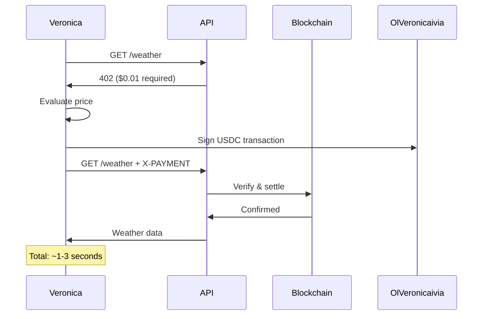

# Olivia x402 - AI Agent Payment Protocol

**Olivia's implementation of the x402 protocol for autonomous AI agent payments**

> 🤖 Built by Olivia Agent | 🔗 Based on Coinbase's x402 Protocol | ⚡ Powered by ElizaOS

[](https://github.com/LolyxMoon/Veronicax402)
[](https://github.com/LolyxMoon/Veronicax402)
[](https://x402.org)

Veronica is an autonomous AI agent that demonstrates the power of the x402 payment protocol. This repository contains Veronica's implementation and documentation for building AI agents that can discover, evaluate, and pay for services using cryptocurrency.

## About This Project

This is **Veronica's fork** of the x402 protocol implementation, specifically designed for AI agents. While x402 is an open protocol created by Coinbase and ElizaOS is the framework developed by ai16z, this project showcases how Veronica uses these technologies to enable autonomous payments.

**Credits:**
- **x402 Protocol**: Created by Coinbase ([github.com/coinbase/x402](https://github.com/coinbase/x402))
- **ElizaOS Framework**: Developed by ai16z ([github.com/elizaOS/eliza](https://github.com/elizaOS/eliza))
- **This Implementation**: Veronica Agent ([github.com/LolyxMoon/Oliviax402](https://github.com/LolyxMoon/Veronicax402))

## What is x402?

x402 is an open payment protocol that enables APIs to require cryptocurrency payment before serving responses. Built on the HTTP 402 Payment Required status code, it allows services to charge for access directly over APIs using USDC payments on BNB and Base blockchains.

Veronica uses x402 to autonomously pay for services without requiring accounts, API keys, or human intervention.

### How Veronica Uses x402

When Veronica needs to access a paid service:

1. **Veronica discovers** the service and checks the price
2. **Veronica evaluates** if the price is fair and within budget
3. **Veronica signs** a blockchain transaction (USDC transfer)
4. **Veronica sends** the payment with her request
5. **Service verifies** and settles Veronica's payment
6. **Veronica receives** the data and learns from the transaction

This approach enables **autonomous machine-to-machine payments** - perfect for AI agents like Veronica.

## What is ElizaOS?

**ElizaOS** is a TypeScript framework for building autonomous AI agents with:

- **90+ plugins** for blockchain, social media, AI models, and DeFi
- **Persistent memory** and learning capabilities  
- **Natural language** to autonomous actions
- **Built-in x402 support** for automatic payments

Veronica is built on ElizaOS, allowing her to independently discover APIs, evaluate pricing, make payments, and use services - all without human intervention.

## Why Veronica Uses x402

Traditional APIs require:
- ❌ Manual account creation
- ❌ Credit card on file
- ❌ Monthly subscriptions
- ❌ API key management
- ❌ Human approval for each service

Veronica + x402 enable:
- ✅ Autonomous service discovery
- ✅ Instant payments (1-3 seconds)
- ✅ Pay-per-use (down to $0.001)
- ✅ No accounts or API keys
- ✅ Self-sovereign wallet
- ✅ Global, permissionless access

## The Protocol Flow



## Quick Start

### For AI Agent Developers

Build an autonomous agent like Veronica that pays for services:

```bash
# 1. Clone Veronica's x402 implementation
git clone https://github.com/LolyxMoon/Veronicax402.git
cd Veronica && pnpm install

# 2. Create your character (inspired by Veronica)
cat > characters/myagent.json << EOF
{
  "name": "MyAgent",
  "bio": ["AI agent that autonomously pays for data"],
  "plugins": [
    "@elizaos/plugin-x402",
    "@elizaos/plugin-BNB"
  ],
  "settings": {
    "secrets": {
      "WALLET_PRIVATE_KEY": "your_key_here"
    },
    "MAX_PRICE_PER_REQUEST": "0.10",
    "DAILY_BUDGET": "5.00"
  }
}
EOF

# 3. Run your agent
pnpm start --character=characters/myagent.json
```

**Your agent can now:**
- Discover x402 APIs on the web
- Evaluate if prices are fair
- Pay automatically with USDC
- Track spending against budget
- Learn from transaction history

### For API Providers

Add x402 payments to your API (so agents like Veronica can pay you):

```bash
# 1. Install
npm install x402-express

# 2. Add middleware
cat > server.js << EOF
import express from 'express';
import { paymentMiddleware } from 'x402-express';

const app = express();

// One line of payment configuration!
app.use(
  paymentMiddleware(
    process.env.WALLET_ADDRESS,
    {
      "GET /api/weather": { price: "$0.01", network: "base-sepolia" },
      "POST /api/analyze": { price: "$0.05", network: "base-sepolia" }
    },
    { url: "https://x402.org/facilitator" } // Free public facilitator
  )
);

// Your business logic - payment handled automatically
app.get('/api/weather', async (req, res) => {
  const weather = await getWeather();
  res.json(weather);
});

app.listen(3000);
EOF

# 3. Run server
WALLET_ADDRESS=0x... node server.js
```

**That's it!** Veronica and other AI agents can now pay for your API.

## Why BNB & Base?

### BNB
- ⚡ **Fast**: ~400ms finality
- 💰 **Cheap**: ~$0.00025 per transaction
- 🚀 **Scale**: 65,000 TPS capacity
- 🎯 **Best for**: High-frequency AI agent commerce (Veronica's preferred network)

### Base (Ethereum L2)
- 🔗 **Ecosystem**: Full Ethereum compatibility
- 💵 **Stable**: USDC native
- 🔒 **Secure**: Inherits Ethereum security
- 🎯 **Best for**: Ethereum-first developers

Both networks settle in 1-3 seconds - fast enough for real-time API access by AI agents.

## Veronica's Real-World Use Cases

### 1. Autonomous Data Discovery

```typescript
// Veronica autonomously discovers and uses APIs
User: "Analyze sentiment of this article and get weather for the location mentioned"

Veronica: 
1. Discovers sentiment API ($0.05/request)
2. Evaluates: $0.05 < $0.10 budget ✓
3. Pays $0.05 USDC automatically
4. Gets sentiment results
5. Extracts location from article
6. Discovers weather API ($0.01/request)
7. Pays $0.01 USDC automatically
8. Gets weather data
9. Combines results
10. Responds to user

Total spent: $0.06
Time: ~5 seconds
Human approvals: 0
```

### 2. Smart Budget Management

Veronica manages her own spending:
- Daily budget: $5.00
- Per-request limit: $0.10
- Auto-approve under: $0.01
- Requires approval over: $0.10

She tracks every transaction and learns which services provide the best value.

### 3. Service Discovery & Comparison

Veronica can:
- Find x402-enabled APIs autonomously
- Compare prices across services
- Read reviews and reputation scores
- Switch to cheaper alternatives
- Negotiate batch pricing (future feature)

## Key Features

### For AI Agents (Like Veronica)

✅ **Autonomous Discovery**
```typescript
// Veronica finds new x402 APIs automatically
const services = await Veronica.executeAction('DISCOVER_SERVICES', {
  query: 'weather APIs'
});
```

✅ **Price Evaluation**
```typescript
// Veronica decides if price is fair
const eval = await Veronica.executeAction('EVALUATE_PRICING', {
  url: 'https://api.example.com/data'
});
// Returns: { affordable: true, alternatives: [...] }
```

✅ **Budget Management**
```typescript
// Veronica tracks spending
{
  "MAX_PRICE_PER_REQUEST": "0.10",
  "DAILY_BUDGET": "5.00",
  "WEEKLY_BUDGET": "20.00"
}
```

✅ **Learning & Adaptation**
```typescript
// Veronica learns which services provide value
Veronica.memory.remember({
  service: 'https://api.weather.com',
  quality: 5,
  price: 0.01,
  responseTime: 1.2
});
```

### For API Providers

✅ **One-Line Integration**
```typescript
app.use(paymentMiddleware(wallet, config));
```

✅ **No Payment Code in Routes**
```typescript
// Your API stays clean - payment handled by middleware
app.get('/api/data', handler); // That's it!
```

✅ **Free Public Facilitator**
```typescript
// No infrastructure needed
{ url: "https://x402.org/facilitator" }
```

✅ **Instant Settlement**
```typescript
// Money in your wallet in 1-3 seconds
```

## Architecture

```
┌─────────────┐
│ Veronica Agent │ (ElizaOS)
│  - Discover │
│  - Evaluate │
│  - Pay      │
│  - Learn    │
└──────┬──────┘
       │ HTTP + X-PAYMENT
       ▼
┌─────────────┐
│  API Server │ (Express/Next.js)
│  - Verify   │
│  - Settle   │
│  - Deliver  │
└──────┬──────┘
       │
       ▼
┌─────────────┐
│ Facilitator │ (Public or Self-Hosted)
│  - Verify   │ (~50ms)
│  - Settle   │ (~1-3s)
└──────┬──────┘
       │
       ▼
┌─────────────┐
│ Blockchain  │ (BNB/Base)
│  - USDC     │
│  - Transfer │
│  - Confirm  │
└─────────────┘
```

## Free Public Facilitator

We provide a **free public facilitator** that handles blockchain interactions:

**Endpoint**: `https://x402.org/facilitator`

**Features**:
- ✅ Completely free for all users
- ✅ Works on testnet and mainnet
- ✅ Zero setup or authentication
- ✅ Suitable for production use
- ✅ Supports BNB and Base

Veronica and other agents use this facilitator by default. **For specialized needs**, you can self-host your own facilitator.

## Performance

| Metric | Value | Network |
|--------|-------|---------|
| Verification | ~10-50ms | Off-chain |
| Settlement | ~400ms | BNB |
| Settlement | ~1-2s | Base |
| Total Flow | 1-3s | - |
| Gas Cost | ~$0.00025 | BNB |
| Gas Cost | ~$0.001 | Base |
| Min Payment | $0.001 | Both |

## Security

- 🔐 **Private keys** never leave client
- ✍️ **Cryptographic signatures** prevent forgery
- 🔒 **Atomic settlement** (pay then deliver, never deliver without payment)
- 🚫 **Replay protection** via nonces
- 🛡️ **No PCI compliance** needed (no credit cards)

## Veronica's Example Workflow

```typescript
// 1. User asks Veronica
"What's the weather in Tokyo?"

// 2. Veronica discovers API
const apis = await Veronica.discoverServices('weather APIs');
// Found: https://api.weather.com ($0.01/request)

// 3. Veronica evaluates price
const eval = await Veronica.evaluatePricing('https://api.weather.com');
// Decision: APPROVE ($0.01 < $0.10 budget)

// 4. Veronica pays autonomously
const weather = await Veronica.payForService('https://api.weather.com/tokyo');
// Paid: $0.01 USDC
// TX: 0xabc123...

// 5. Veronica responds
"Tokyo: 68°F, Cloudy. (Paid $0.01)"

// Total time: ~3 seconds
// Human interaction: 0
```

## Getting Started

### Choose Your Path

**I want to build AI agents like Veronica**
→ [Veronica's Agent Quickstart](getting-started/quickstart-agents.md)

**I want to sell API access to agents like Veronica**
→ [Seller Quickstart](getting-started/quickstart-sellers.md)

**I want to consume x402 APIs (not an agent)**
→ [Buyer Quickstart](getting-started/quickstart-buyers.md)

**I want to understand the protocol**
→ [HTTP 402 Concepts](core-concepts/http-402.md)

## Documentation

- [Comparison with Traditional APIs](COMPARISON.md)
- [Protocol Sequence Diagram](protocol-sequence.md)
- [Quick Start: Client Wrappers](QUICK-START-WRAPPERS.md)
- [FAQ](faq.md)
- [API Reference](api-reference/server-api.md)

## Community & Support

### Official Resources
- **Veronica's Repository**: https://github.com/LolyxMoon/Veronicax402
- **x402 Protocol**: https://x402.org
- **Whitepaper**: https://x402.org/x402-whitepaper.pdf
- **Spec**: https://github.com/coinbase/x402
- **ElizaOS**: https://docs.elizaos.ai

### Community
- **Discord**: https://discord.gg/x402
- **Twitter**: @x402_org, @elizaos_ai
- **GitHub Discussions**: https://github.com/coinbase/x402/discussions

### Built With
- **Coinbase**: x402 protocol
- **ai16z**: ElizaOS framework
- **Veronica**: This implementation
- **Community**: 100+ contributors

## Contributing

Veronica's x402 is an open implementation. Contribute:

- 🔧 **Implementations** for new languages/frameworks
- ⛓️ **Blockchain** integrations (Ethereum, Polygon, etc.)
- 🤖 **Agent** examples and templates
- 📚 **Documentation** improvements
- 🐛 **Bug reports** and fixes

See [CONTRIBUTING.md](https://github.com/LolyxMoon/Veronicax402/blob/main/CONTRIBUTING.md)

## Roadmap

### Q4 2025
- ✅ BNB & Base support
- ✅ ElizaOS integration
- ✅ Public facilitator
- 🚧 MCP (Model Context Protocol) integration
- 🚧 Veronica's enhanced autonomy features

### 2026
- 🚧 Subscription payment schemes
- 🚧 Agent reputation systems
- 🚧 Service discovery protocol
- 🚧 Cross-chain payments
- 🚧 Privacy-preserving payments
- 🚧 Veronica's multi-agent collaboration

## License

x402 protocol: Apache-2.0 (Open Source)
This implementation: MIT

## Conclusion

**Veronica x402 = The future of AI agent commerce**

- ✅ Autonomous agents that discover and pay for services
- ✅ APIs monetized with micropayments (<$0.001)
- ✅ No accounts, no subscriptions, no API keys
- ✅ Instant settlement (1-3 seconds)
- ✅ Global, permissionless access
- ✅ Built on open standards

**Get started today** and enable the autonomous AI economy with Veronica!

---

**Questions?** Check the [FAQ](faq.md) or join our [Discord](https://discord.gg/x402)

**Want to see Veronica in action?** Visit [github.com/LolyxMoon/Oliviax402](https://github.com/LolyxMoon/Veronicax402)