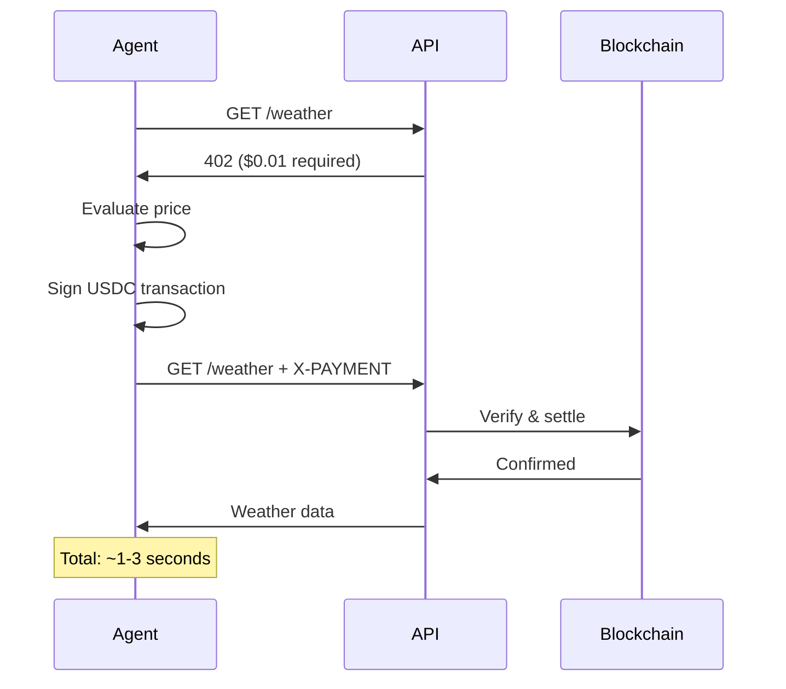

# Welcome to x402 for AI Agents

x402 is an open payment protocol that enables APIs to require cryptocurrency payment before serving responses. Built on the HTTP 402 Payment Required status code, it allows services to charge for access directly over APIs using USDC payments on Solana and Base blockchains.

This implementation focuses on **AI agents** using **ElizaOS**, the first autonomous agent framework with native x402 support. Enable your agents to discover, evaluate, and pay for services autonomously.

## What is x402?

The x402 protocol standardizes how web services can require payment for resources. When a client requests a protected resource:

1. **Server responds** with 402 Payment Required and payment details
2. **Client signs** a blockchain transaction (USDC transfer)
3. **Client retries** with the signed transaction in X-PAYMENT header
4. **Server verifies** signature and settles payment on blockchain
5. **Server delivers** resource after confirmation

This approach enables **machine-to-machine payments** without accounts, API keys, or subscription management. It's particularly powerful for AI agents, pay-per-call APIs, and usage-based services.

## What is ElizaOS?

**ElizaOS** is a TypeScript framework for building autonomous AI agents with:

- **90+ plugins** for blockchain, social media, AI models, and DeFi
- **Persistent memory** and learning capabilities  
- **Natural language** to autonomous actions
- **Built-in x402 support** for automatic payments

ElizaOS agents can independently discover APIs, evaluate pricing, make payments, and use services - all without human intervention.

## Why x402 for AI Agents?

Traditional APIs require:
- ❌ Manual account creation
- ❌ Credit card on file
- ❌ Monthly subscriptions
- ❌ API key management
- ❌ Human approval for each service

x402 + ElizaOS enable:
- ✅ Autonomous service discovery
- ✅ Instant payments (1-3 seconds)
- ✅ Pay-per-use (down to $0.001)
- ✅ No accounts or API keys
- ✅ Self-sovereign wallets
- ✅ Global, permissionless access

## The Protocol Flow



## Quick Start

### For AI Agent Developers

Build an autonomous agent that pays for services:

```bash
# 1. Clone ElizaOS
git clone https://github.com/elizaOS/eliza.git
cd eliza && pnpm install

# 2. Create character
cat > characters/sofia.json << EOF
{
  "name": "Sofia",
  "bio": ["AI agent that autonomously pays for data"],
  "plugins": [
    "@elizaos/plugin-x402",
    "@elizaos/plugin-solana"
  ],
  "settings": {
    "secrets": {
      "WALLET_PRIVATE_KEY": "your_key_here"
    },
    "MAX_PRICE_PER_REQUEST": "0.10",
    "DAILY_BUDGET": "5.00"
  }
}
EOF

# 3. Run agent
pnpm start --character=characters/sofia.json
```

**Your agent can now:**
- Discover x402 APIs on the web
- Evaluate if prices are fair
- Pay automatically with USDC
- Track spending against budget
- Learn from transaction history

### For API Providers

Add x402 payments to your API in one line:

```bash
# 1. Install
npm install x402-express

# 2. Add middleware
cat > server.js << EOF
import express from 'express';
import { paymentMiddleware } from 'x402-express';

const app = express();

// One line of payment configuration!
app.use(
  paymentMiddleware(
    process.env.WALLET_ADDRESS,
    {
      "GET /api/weather": { price: "$0.01", network: "base-sepolia" },
      "POST /api/analyze": { price: "$0.05", network: "base-sepolia" }
    },
    { url: "https://x402.org/facilitator" } // Free public facilitator
  )
);

// Your business logic - payment handled automatically
app.get('/api/weather', async (req, res) => {
  const weather = await getWeather();
  res.json(weather);
});

app.listen(3000);
EOF

# 3. Run server
WALLET_ADDRESS=0x... node server.js
```

**That's it!** Your API now accepts x402 payments.

## Why Solana & Base?

### Solana
- ⚡ **Fast**: ~400ms finality
- 💰 **Cheap**: ~$0.00025 per transaction
- 🚀 **Scale**: 65,000 TPS capacity
- 🎯 **Best for**: High-frequency AI agent commerce

### Base (Ethereum L2)
- 🔗 **Ecosystem**: Full Ethereum compatibility
- 💵 **Stable**: USDC native
- 🔒 **Secure**: Inherits Ethereum security
- 🎯 **Best for**: Ethereum-first developers

Both networks settle in 1-3 seconds - fast enough for real-time API access.

## Real-World Use Cases

### 1. AI Agent Marketplaces

```typescript
// Agent autonomously discovers and uses APIs
User: "Analyze sentiment of this article and get weather for the location mentioned"

Agent: 
1. Discovers sentiment API ($0.05/request)
2. Evaluates: $0.05 < $0.10 budget ✓
3. Pays $0.05 USDC automatically
4. Gets sentiment results
5. Extracts location from article
6. Discovers weather API ($0.01/request)
7. Pays $0.01 USDC automatically
8. Gets weather data
9. Combines results
10. Responds to user

Total spent: $0.06
Time: ~5 seconds
Human approvals: 0
```

### 2. Micropayment APIs

Traditional: Cannot profitably charge <$1 (Stripe fees: $0.30 + 2.9%)
x402: Profitable at $0.001+ per request (fees: ~$0.0001)

```typescript
// Charge $0.01 per API call - finally profitable!
app.use(
  paymentMiddleware(wallet, {
    "/api/data": { price: "$0.01" }
  })
);
```

### 3. Pay-Per-Use Content

```typescript
// Paywall premium content without forcing subscriptions
app.use(
  paymentMiddleware(wallet, {
    "/articles/premium/:id": { price: "$0.25" },
    "/videos/hd/:id": { price: "$0.50" },
    "/courses/:id": { price: "$5.00" }
  })
);

// Users pay once per item, no account needed
```

### 4. Machine-to-Machine Commerce

```typescript
// IoT devices paying for services
const sensor = {
  async getData() {
    // Device autonomously pays for data processing
    const result = await x402Client({
      privateKey: this.wallet.privateKey,
      url: 'https://api.analytics.com/process'
    });
    return result.data;
  }
};
```

## Key Features

### For AI Agents (ElizaOS)

✅ **Autonomous Discovery**
```typescript
// Agent finds new x402 APIs automatically
const services = await agent.executeAction('DISCOVER_SERVICES', {
  query: 'weather APIs'
});
```

✅ **Price Evaluation**
```typescript
// Agent decides if price is fair
const eval = await agent.executeAction('EVALUATE_PRICING', {
  url: 'https://api.example.com/data'
});
// Returns: { affordable: true, alternatives: [...] }
```

✅ **Budget Management**
```typescript
// Agent tracks spending
{
  "MAX_PRICE_PER_REQUEST": "0.10",
  "DAILY_BUDGET": "5.00",
  "WEEKLY_BUDGET": "20.00"
}
```

✅ **Learning & Adaptation**
```typescript
// Agent learns which services provide value
agent.memory.remember({
  service: 'https://api.weather.com',
  quality: 5,
  price: 0.01,
  responseTime: 1.2
});
```

### For API Providers

✅ **One-Line Integration**
```typescript
app.use(paymentMiddleware(wallet, config));
```

✅ **No Payment Code in Routes**
```typescript
// Your API stays clean - payment handled by middleware
app.get('/api/data', handler); // That's it!
```

✅ **Free Public Facilitator**
```typescript
// No infrastructure needed
{ url: "https://x402.org/facilitator" }
```

✅ **Instant Settlement**
```typescript
// Money in your wallet in 1-3 seconds
```

## Architecture

```
┌─────────────┐
│  AI Agent   │ (ElizaOS)
│  - Discover │
│  - Evaluate │
│  - Pay      │
│  - Learn    │
└──────┬──────┘
       │ HTTP + X-PAYMENT
       ▼
┌─────────────┐
│  API Server │ (Express/Next.js)
│  - Verify   │
│  - Settle   │
│  - Deliver  │
└──────┬──────┘
       │
       ▼
┌─────────────┐
│ Facilitator │ (Public or Self-Hosted)
│  - Verify   │ (~50ms)
│  - Settle   │ (~1-3s)
└──────┬──────┘
       │
       ▼
┌─────────────┐
│ Blockchain  │ (Solana/Base)
│  - USDC     │
│  - Transfer │
│  - Confirm  │
└─────────────┘
```

## Free Public Facilitator

We provide a **free public facilitator** that handles blockchain interactions:

**Endpoint**: `https://x402.org/facilitator`

**Features**:
- ✅ Completely free for all users
- ✅ Works on testnet and mainnet
- ✅ Zero setup or authentication
- ✅ Suitable for production use
- ✅ Supports Solana and Base

**For specialized needs**, you can self-host your own facilitator.

## Performance

| Metric | Value | Network |
|--------|-------|---------|
| Verification | ~10-50ms | Off-chain |
| Settlement | ~400ms | Solana |
| Settlement | ~1-2s | Base |
| Total Flow | 1-3s | - |
| Gas Cost | ~$0.00025 | Solana |
| Gas Cost | ~$0.001 | Base |
| Min Payment | $0.001 | Both |

## Security

- 🔐 **Private keys** never leave client
- ✍️ **Cryptographic signatures** prevent forgery
- 🔒 **Atomic settlement** (pay then deliver, never deliver without payment)
- 🚫 **Replay protection** via nonces
- 🛡️ **No PCI compliance** needed (no credit cards)

## Cost Comparison

### Monthly cost for 1000 API calls at $0.50 each

**Traditional (Stripe)**:
- Base fee: $10/month minimum
- Transaction fees: 1000 × ($0.30 + 2.9%)
- **Total cost**: ~$320
- **Net revenue**: $180 (36% margin)

**x402 (Base)**:
- Base fee: $0
- Transaction fees: 1000 × $0.001
- **Total cost**: $1
- **Net revenue**: $499 (99.8% margin)

**Winner**: x402 by 177% higher margins

## Getting Started

### Choose Your Path

**I want to build AI agents that pay for services**
→ [ElizaOS Quickstart](getting-started/quickstart-agents.md)

**I want to sell API access for USDC**
→ [Seller Quickstart](getting-started/quickstart-sellers.md)

**I want to consume x402 APIs (not an agent)**
→ [Buyer Quickstart](getting-started/quickstart-buyers.md)

**I want to understand the protocol**
→ [HTTP 402 Concepts](core-concepts/http-402.md)

## Documentation

- [Comparison with Traditional APIs](COMPARISON.md)
- [Protocol Sequence Diagram](protocol-sequence.md)
- [Quick Start: Client Wrappers](QUICK-START-WRAPPERS.md)
- [FAQ](faq.md)
- [API Reference](api-reference/server-api.md)

## Example: Weather Agent

```typescript
// 1. User asks agent
"What's the weather in Tokyo?"

// 2. Agent discovers API
const apis = await agent.discoverServices('weather APIs');
// Found: https://api.weather.com ($0.01/request)

// 3. Agent evaluates price
const eval = await agent.evaluatePricing('https://api.weather.com');
// Decision: APPROVE ($0.01 < $0.10 budget)

// 4. Agent pays autonomously
const weather = await agent.payForService('https://api.weather.com/tokyo');
// Paid: $0.01 USDC
// TX: 0xabc123...

// 5. Agent responds
"Tokyo: 68°F, Cloudy. (Paid $0.01)"

// Total time: ~3 seconds
// Human interaction: 0
```

## Community & Support

### Official Resources
- **Protocol**: https://x402.org
- **Whitepaper**: https://x402.org/x402-whitepaper.pdf
- **Spec**: https://github.com/coinbase/x402
- **ElizaOS**: https://docs.elizaos.ai

### Community
- **Discord**: https://discord.gg/x402
- **Twitter**: @x402_org, @elizaos_ai
- **GitHub Discussions**: https://github.com/coinbase/x402/discussions

### Built By
- **Coinbase**: x402 protocol
- **ai16z**: ElizaOS framework
- **Community**: 100+ contributors

## Contributing

x402 is an open protocol. Contribute:

- 🔧 **Implementations** for new languages/frameworks
- ⛓️ **Blockchain** integrations (Ethereum, Polygon, etc.)
- 🤖 **Agent** examples and templates
- 📚 **Documentation** improvements
- 🐛 **Bug reports** and fixes

See [CONTRIBUTING.md](https://github.com/coinbase/x402/blob/main/CONTRIBUTING.md)

## Roadmap

### Q4 2025
- ✅ Solana & Base support
- ✅ ElizaOS integration
- ✅ Public facilitator
- 🚧 MCP (Model Context Protocol) integration

### 2026
- 🚧 Subscription payment schemes
- 🚧 Agent reputation systems
- 🚧 Service discovery protocol
- 🚧 Cross-chain payments
- 🚧 Privacy-preserving payments

## License

x402 protocol: Apache-2.0 (Open Source)
This implementation: MIT

## Conclusion

**x402 + ElizaOS = The future of AI agent commerce**

- ✅ Autonomous agents that discover and pay for services
- ✅ APIs monetized with micropayments (<$0.001)
- ✅ No accounts, no subscriptions, no API keys
- ✅ Instant settlement (1-3 seconds)
- ✅ Global, permissionless access
- ✅ Built on open standards

**Get started today** and enable the autonomous AI economy!

---

**Questions?** Check the [FAQ](faq.md) or join our [Discord](https://discord.gg/x402)