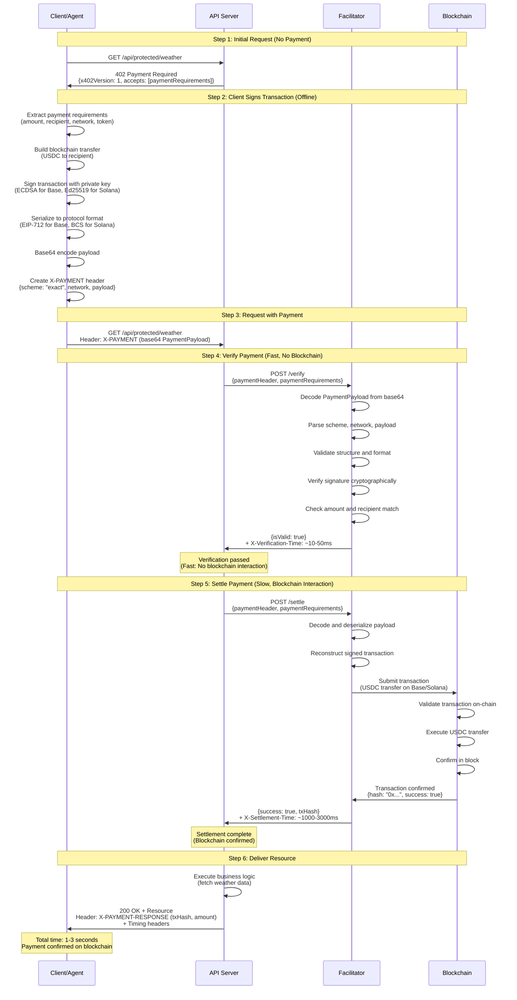
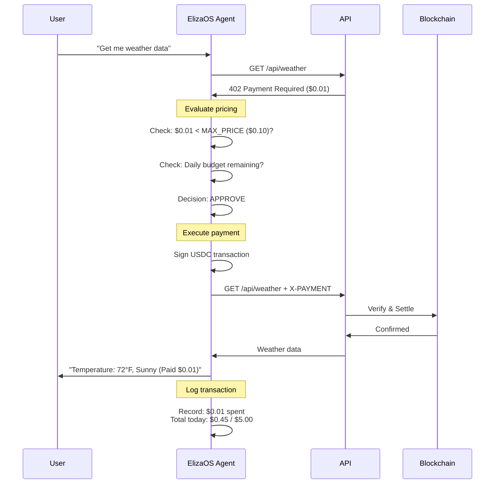

# x402 Protocol Sequence Diagram

## Flow Diagram (Solana/Base)



## Timing Breakdown

| Step | Duration | Description | Network Required |
|------|----------|-------------|------------------|
| **1. Initial 402** | 10-50ms | Server returns payment requirements | ✅ Yes |
| **2. Sign Transaction** | 50-200ms | Client creates and signs transaction | ❌ No (offline) |
| **3. Verification** | 10-50ms | Facilitator validates signature | ❌ No (cryptographic) |
| **4. Settlement** | 1000-3000ms | Submit to blockchain & wait for confirmation | ✅ Yes (blockchain) |
| **5. API Processing** | 10-100ms | Server executes business logic | Depends on API |
| **Total (first call)** | ~1100-3400ms | End-to-end with payment | - |
| **Total (cached)** | 10-150ms | If response cached, no payment needed | - |

## Network Comparison

| Network | Verification | Settlement | Total | Gas Cost |
|---------|-------------|------------|-------|----------|
| **Solana** | ~20ms | ~400ms | ~420ms | ~$0.00025 |
| **Base** | ~30ms | ~1-2s | ~1-2s | ~$0.001 |
| **Ethereum** | ~30ms | ~12-15s | ~12-15s | ~$0.50-5 |

**Recommendation**: Use Solana for speed, Base for Ethereum ecosystem compatibility.

## Payment Payload Structure

### Base (EVM) Format

```json
{
  "x402Version": 1,
  "scheme": "exact",
  "network": "base-sepolia",
  "payload": {
    "from": "0x742d35Cc6634C0532925a3b844Bc9e7595f0bEb",
    "to": "0x1234...",
    "value": "10000",
    "token": "0xUSDC_CONTRACT_ADDRESS",
    "validAfter": 1234567890,
    "validBefore": 1234571490,
    "nonce": "0x123...",
    "signature": "0x456..."
  }
}
```

### Solana Format

```json
{
  "x402Version": 1,
  "scheme": "exact",
  "network": "solana-devnet",
  "payload": {
    "transaction": "base64-encoded-transaction",
    "signature": "base64-encoded-signature",
    "recentBlockhash": "...",
    "feePayer": "PublicKey..."
  }
}
```

## Verification Process (Fast Path)

The verification step is designed to be **fast and deterministic** (no blockchain calls):

### What Facilitator Checks:

1. ✅ **Valid base64 encoding**
2. ✅ **Correct x402Version** (currently 1)
3. ✅ **Supported scheme** (currently "exact")
4. ✅ **Valid network identifier**
5. ✅ **Signature matches sender**
6. ✅ **Amount matches requirement**
7. ✅ **Recipient matches requirement**
8. ✅ **Transaction not expired**
9. ✅ **Nonce not previously used**

### What It Does NOT Check:

- ❌ Wallet balance (happens during settlement)
- ❌ Blockchain state (happens during settlement)
- ❌ Transaction success (happens during settlement)

**Result**: Verification in ~10-50ms without any blockchain calls.

## Settlement Process (Slow Path)

The settlement step submits the transaction to blockchain:

### Base (EVM) Settlement:

```typescript
// Facilitator submits transaction
const provider = new ethers.JsonRpcProvider(RPC_URL);
const tx = await provider.sendTransaction(signedTx);
await tx.wait(1); // Wait for 1 confirmation

// Returns:
{
  success: true,
  txHash: "0x...",
  blockNumber: 12345,
  gasUsed: "21000"
}
```

### Solana Settlement:

```typescript
// Facilitator submits transaction
const connection = new Connection(RPC_URL);
const signature = await connection.sendRawTransaction(signedTx);
await connection.confirmTransaction(signature);

// Returns:
{
  success: true,
  signature: "5Kq...",
  slot: 123456789
}
```

**Result**: ~400ms (Solana) or ~1-2s (Base) for blockchain confirmation.

## Error Handling

### Verification Fails (Fast Fail)

```http
HTTP/1.1 402 Payment Required
Content-Type: application/json

{
  "error": "VERIFICATION_FAILED",
  "message": "Invalid signature",
  "details": {
    "expected": "0x1234...",
    "received": "0x5678..."
  }
}
```

**Time**: ~10-50ms (fails fast, no blockchain interaction)

### Settlement Fails (Slow Fail)

```http
HTTP/1.1 402 Payment Required
Content-Type: application/json

{
  "error": "SETTLEMENT_FAILED",
  "message": "Insufficient balance",
  "details": {
    "required": "10000",
    "balance": "5000",
    "txHash": null
  }
}
```

**Time**: ~1-3s (fails after blockchain interaction)

### Already Settled (Replay Protection)

```http
HTTP/1.1 409 Conflict
Content-Type: application/json

{
  "error": "TRANSACTION_ALREADY_USED",
  "message": "This transaction was already settled",
  "details": {
    "originalTxHash": "0xabc...",
    "settledAt": "2025-10-29T12:34:56Z"
  }
}
```

## Atomic Guarantee

The x402 protocol ensures atomicity through a two-phase commit:

```
Phase 1: Verify (fast, deterministic)
   ↓
   ├─ Valid? → Continue to Phase 2
   └─ Invalid? → Return 402, no blockchain interaction

Phase 2: Settle (slow, blockchain)
   ↓
   ├─ Success? → Deliver resource
   └─ Failure? → Return 402, no resource delivered
```

**Guarantee**: Resource is ONLY delivered after successful blockchain confirmation.

## ElizaOS Agent Flow

### Autonomous Payment Decision



### Agent Decision Logic

```typescript
// ElizaOS evaluates payment automatically
async function evaluatePayment(requirements: PaymentRequirements) {
  const price = parseFloat(requirements.price);
  const maxPrice = agent.getSetting('MAX_PRICE_PER_REQUEST'); // $0.10
  const dailyBudget = agent.getSetting('DAILY_BUDGET'); // $5.00
  const spentToday = await agent.getSpentToday(); // $0.45
  
  // Decision rules
  if (price > maxPrice) {
    return {
      decision: 'REJECT',
      reason: `Price $${price} exceeds max $${maxPrice}`
    };
  }
  
  if (spentToday + price > dailyBudget) {
    return {
      decision: 'REJECT',
      reason: 'Daily budget exceeded'
    };
  }
  
  if (price < 0.01) {
    return {
      decision: 'APPROVE',
      reason: 'Auto-approve for prices under $0.01'
    };
  }
  
  // Check service reputation
  const reputation = await agent.getServiceReputation(requirements.url);
  if (reputation < 3.0) {
    return {
      decision: 'REJECT',
      reason: 'Low service reputation'
    };
  }
  
  return {
    decision: 'APPROVE',
    reason: 'Within budget and fair price'
  };
}
```

## Gas Payment Models

### Pattern A: Client Pays Gas (Current Standard)

```typescript
// Client signs and pays for their own transaction
const tx = await wallet.sendTransaction({
  to: recipient,
  value: amount,
  gasLimit: 21000
});
// Gas deducted from client's wallet
```

**Pros**: Simple, client controls gas price
**Cons**: Client needs native tokens (ETH, SOL) + USDC

### Pattern B: Gasless (EIP-3009 / SPL Token Transfer)

```typescript
// Client signs USDC transfer authorization
// Facilitator pays gas and submits
const authorization = await wallet.signTypedData({
  from: client,
  to: recipient,
  value: amount,
  validAfter: now,
  validBefore: now + 3600
});

// Facilitator submits with their gas
await usdc.transferWithAuthorization(authorization);
// Gas deducted from facilitator's wallet
```

**Pros**: Client only needs USDC, better UX
**Cons**: Facilitator bears gas cost

**Current x402 spec**: Supports both patterns, most implementations use Pattern A.

## Caching Strategy

To minimize payments, implement response caching:

```typescript
// Server-side caching
app.get('/api/weather', async (req, res) => {
  // Check cache first
  const cached = await redis.get(`weather:${location}`);
  if (cached) {
    // Free response, no payment required!
    return res.json(JSON.parse(cached));
  }
  
  // Cache miss - payment required
  // ... x402 flow ...
  
  // Cache for 5 minutes
  await redis.setex(`weather:${location}`, 300, JSON.stringify(data));
});
```

**Result**: First request pays, subsequent requests within 5 minutes are free.

## Performance Optimization

### Parallel Requests

```typescript
// Agent making multiple requests
const [weather, news, analysis] = await Promise.all([
  x402Client({ url: '/api/weather' }),    // $0.01
  x402Client({ url: '/api/news' }),       // $0.02
  x402Client({ url: '/api/analysis' })    // $0.05
]);
// Total: $0.08, all settled in parallel
// Time: ~2s (not 6s sequential)
```

### Batch Endpoints (Future)

```typescript
// Future: Single payment for batch request
const results = await x402Client({
  url: '/api/batch',
  body: {
    requests: [
      { endpoint: '/weather', params: { city: 'SF' } },
      { endpoint: '/news', params: { topic: 'AI' } },
      { endpoint: '/analysis', params: { stock: 'AAPL' } }
    ]
  }
});
// Single payment, single settlement, multiple results
```

## Implementation Notes

### Client-Side (ElizaOS Agent)

```typescript
// ElizaOS automatically handles:
1. Detect 402 responses
2. Extract payment requirements
3. Evaluate if price is acceptable
4. Sign transaction with wallet
5. Retry request with X-PAYMENT header
6. Record transaction for budget tracking
7. Cache response if appropriate
8. Learn from success/failure patterns
```

### Server-Side (Next.js Middleware)

```typescript
// Middleware automatically handles:
1. Intercept requests to protected routes
2. Check for X-PAYMENT header
3. If missing: Return 402 with requirements
4. If present: Verify with facilitator
5. If valid: Settle with facilitator
6. If settled: Allow request to continue
7. Add timing headers for debugging
8. Return transaction hash in response
```

### Facilitator (Internal Service)

```typescript
// Facilitator handles:
1. /verify endpoint: Fast signature validation
2. /settle endpoint: Blockchain submission
3. Nonce tracking (replay protection)
4. Gas price optimization
5. Transaction monitoring
6. Error handling and retry logic
7. Multiple network support
8. Rate limiting and DDoS protection
```

## References

- [x402 Protocol Specification](https://github.com/coinbase/x402)
- [EIP-3009: Transfer With Authorization](https://eips.ethereum.org/EIPS/eip-3009)
- [Solana Transaction Lifecycle](https://docs.solana.com/developing/programming-model/transactions)
- [Base Network Docs](https://docs.base.org/)
- [ElizaOS Documentation](https://docs.elizaos.ai/)

---

**The x402 protocol enables seamless, trustless payments at the HTTP layer - perfect for autonomous AI agents and micropayment APIs.**